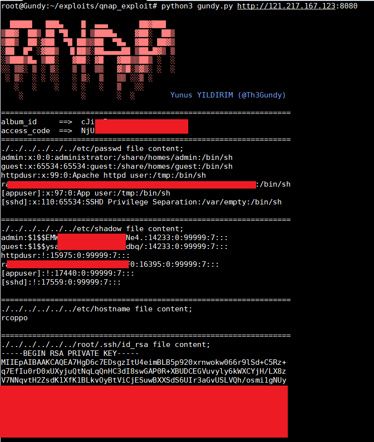

# QNAP Pre-Auth Root RCE (CVE-2019-7192 ~ CVE-2019-7195) Exploit
for now, you can read system files (/etc/shadow, ssh private key, etc.)

Usage:

```
pip install -r requirements.txt # or just pip install requests
python3 gundy.py https://vulnerable_url:port
```

## Sample Output


## Vulnerability

The vulnerabilities can be chained as a pre-auth root RCE, visit the following links for more details:

- [CyCraft Write-Up](https://medium.com/@cycraft_corp/fc8af285622e)
- [QNAP's Security Advisory](https://www.qnap.com/zh-tw/security-advisory/nas-201911-25)

